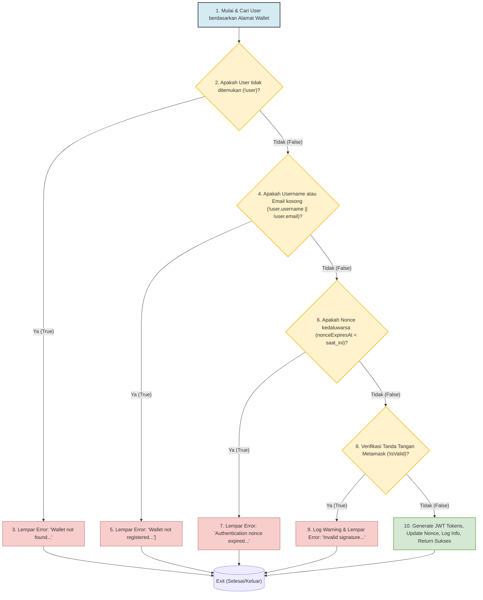
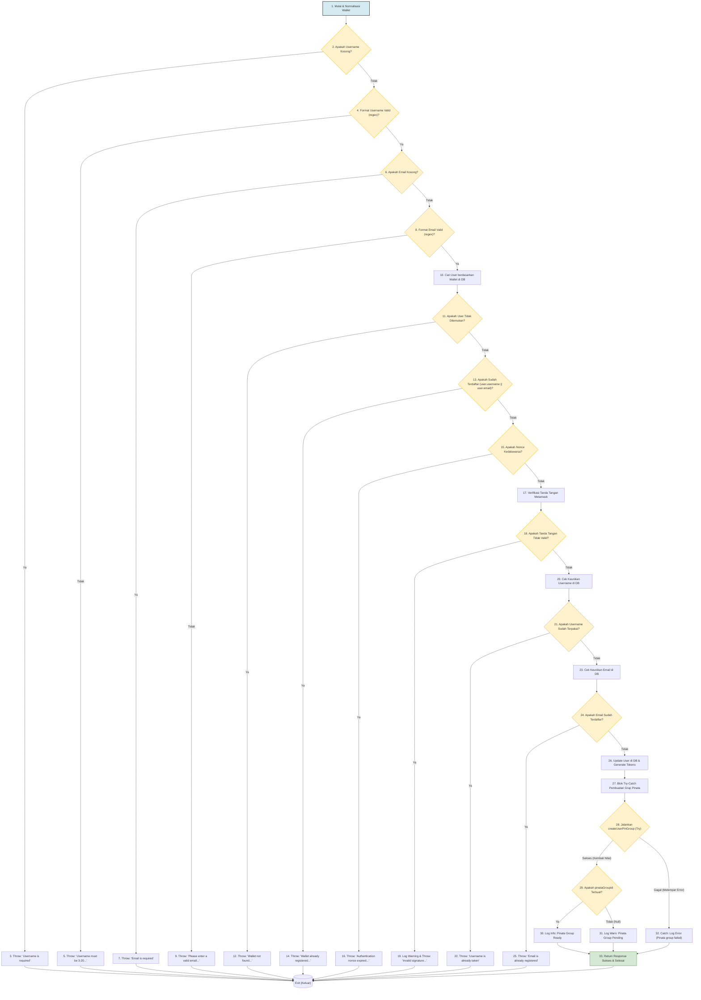

# Laporan Pengujian Whitebox Testing - Layanan Autentikasi Backend DecentraShare

Laporan ini disusun untuk mendokumentasikan pengujian *whitebox* (pengujian kotak putih) yang dilakukan pada modul autentikasi backend sistem **DecentraShare**. Fokus pengujian adalah pada file `auth.service.ts` yang mengelola alur logika krusial untuk:
1. `loginWithWallet` - Masuk menggunakan tanda tangan wallet Metamask.
2. `registerUser` - Pendaftaran profil pengguna baru yang ditautkan ke wallet.

---

## 1. Pendahuluan Whitebox Testing

Pengujian *whitebox* (atau *glassbox/structural testing*) adalah metode pengujian perangkat lunak di mana struktur internal, alur logika, kontrol percabangan, dan baris kode sumber dari aplikasi diuji secara langsung. Tujuan utama dari pengujian ini adalah untuk memastikan bahwa:
- Semua jalur independen (basis paths) dieksekusi setidaknya sekali.
- Seluruh keputusan logis (kondisi true/false) diuji pada kedua arah.
- Semua baris kode tercakup dengan target coverage **100%**.
- Penanganan kesalahan defensif (defensive error handling) berfungsi sebagaimana mestinya.

Dalam laporan ini, struktur kontrol logika dianalisis menggunakan diagram **Control Flow Graph (CFG)**, Kompleksitas Siklomatis McCabe, perancangan kasus uji berbasis jalur independen, dan laporan persentase cakupan kode (Code Coverage).

---

## 2. Analisis `loginWithWallet`

### 2.1. Control Flow Graph (CFG) `loginWithWallet`

Berikut adalah representasi grafis alur kontrol logika fungsi `loginWithWallet` yang dimodelkan menggunakan Mermaid diagram:



### 2.2. Perhitungan Kompleksitas Siklomatis (Cyclomatic Complexity)

Kompleksitas Siklomatis McCabe ($V(G)$) mengukur jumlah jalur independen dalam graf kontrol. Dihitung menggunakan rumus:

$$V(G) = E - N + 2$$

Dimana:
*   $E$ (Edges/Sisi) = Jumlah anak panah hubungan antar simpul.
*   $N$ (Nodes/Simpul) = Jumlah pernyataan instruksi logika.

Berdasarkan graf di atas dengan menyertakan simpul keluar tunggal virtual ($Exit$):
*   $N = 11$ (Simpul 1 s.d. 10 ditambah Simpul Exit)
*   $E = 14$ (Detail sisi: 1 $\rightarrow$ 2, 2 $\rightarrow$ 3, 2 $\rightarrow$ 4, 3 $\rightarrow$ Exit, 4 $\rightarrow$ 5, 4 $\rightarrow$ 6, 5 $\rightarrow$ Exit, 6 $\rightarrow$ 7, 6 $\rightarrow$ 8, 7 $\rightarrow$ Exit, 8 $\rightarrow$ 9, 8 $\rightarrow$ 10, 9 $\rightarrow$ Exit, 10 $\rightarrow$ Exit)

$$V(G) = 14 - 11 + 2 = 5$$

Alternatif perhitungan menggunakan jumlah simpul predikat ($P$ yaitu simpul percabangan `if`):

$$V(G) = P + 1$$

Simpul percabangan adalah 2, 4, 6, dan 8 (terdapat 4 kondisi `if`), sehingga:

$$V(G) = 4 + 1 = 5$$

Maka, terdapat **5 jalur independen** yang harus diuji untuk fungsi `loginWithWallet`.

### 2.3. Jalur Independen (Basis Paths) `loginWithWallet`

1.  **Path 1:** $1 \rightarrow 2 \rightarrow 3 \rightarrow Exit$  
    (Kasus wallet belum terdaftar/tidak ditemukan di DB).
2.  **Path 2:** $1 \rightarrow 2 \rightarrow 4 \rightarrow 5 \rightarrow Exit$  
    (Kasus wallet ditemukan tetapi data username/email masih null - perlu registrasi).
3.  **Path 3:** $1 \rightarrow 2 \rightarrow 4 \rightarrow 6 \rightarrow 7 \rightarrow Exit$  
    (Kasus nonce kedaluwarsa).
4.  **Path 4:** $1 \rightarrow 2 \rightarrow 4 \rightarrow 6 \rightarrow 8 \rightarrow 9 \rightarrow Exit$  
    (Kasus verifikasi tanda tangan Metamask tidak valid/gagal).
5.  **Path 5:** $1 \rightarrow 2 \rightarrow 4 \rightarrow 6 \rightarrow 8 \rightarrow 10 \rightarrow Exit$  
    (Kasus sukses login, token diterbitkan, dan nonce dirotasi).

---

## 3. Analisis `registerUser`

### 3.1. Control Flow Graph (CFG) `registerUser`

Berikut adalah representasi grafis alur kontrol logika fungsi `registerUser` yang dimodelkan menggunakan Mermaid diagram:



### 3.2. Perhitungan Kompleksitas Siklomatis (Cyclomatic Complexity)

Berdasarkan graf percabangan `registerUser` di atas dengan simpul keluar tunggal virtual ($Exit$):
*   $N = 34$ (Simpul 1 s.d. 33 ditambah Simpul Exit)
*   $E = 45$ (Sesuai dengan detail jalur anak panah percabangan)

$$V(G) = E - N + 2$$
$$V(G) = 45 - 34 + 2 = 13$$

Menggunakan perhitungan predikat ($P$ simpul keputusan):
Ada **12** simpul keputusan percabangan (`if` dan `try-catch`): Simpul 2, 4, 6, 8, 11, 13, 15, 18, 21, 24, 28 (sebagai batas try-catch), dan 29.

$$V(G) = P + 1$$
$$V(G) = 12 + 1 = 13$$

Maka, terdapat **13 jalur independen** yang harus diuji untuk fungsi `registerUser`.

### 3.3. Jalur Independen (Basis Paths) `registerUser`

1.  **Path 1:** $1 \rightarrow 2 \rightarrow 3 \rightarrow Exit$ (Username kosong).
2.  **Path 2:** $1 \rightarrow 2 \rightarrow 4 \rightarrow 5 \rightarrow Exit$ (Format username tidak valid).
3.  **Path 3:** $1 \rightarrow 2 \rightarrow 4 \rightarrow 6 \rightarrow 7 \rightarrow Exit$ (Email kosong).
4.  **Path 4:** $1 \rightarrow 2 \rightarrow 4 \rightarrow 6 \rightarrow 8 \rightarrow 9 \rightarrow Exit$ (Format email tidak valid).
5.  **Path 5:** $1 \rightarrow 2 \rightarrow 4 \rightarrow 6 \rightarrow 8 \rightarrow 10 \rightarrow 11 \rightarrow 12 \rightarrow Exit$ (Wallet tidak ditemukan di DB).
6.  **Path 6:** $1 \rightarrow 2 \rightarrow 4 \rightarrow 6 \rightarrow 8 \rightarrow 10 \rightarrow 11 \rightarrow 13 \rightarrow 14 \rightarrow Exit$ (Wallet sudah pernah terdaftar).
7.  **Path 7:** $1 \rightarrow 2 \rightarrow 4 \rightarrow 6 \rightarrow 8 \rightarrow 10 \rightarrow 11 \rightarrow 13 \rightarrow 15 \rightarrow 16 \rightarrow Exit$ (Nonce tanda tangan kedaluwarsa).
8.  **Path 8:** $1 \rightarrow 2 \rightarrow 4 \rightarrow 6 \rightarrow 8 \rightarrow 10 \rightarrow 11 \rightarrow 13 \rightarrow 15 \rightarrow 17 \rightarrow 18 \rightarrow 19 \rightarrow Exit$ (Tanda tangan Metamask tidak valid).
9.  **Path 9:** $1 \rightarrow 2 \rightarrow 4 \rightarrow 6 \rightarrow 8 \rightarrow 10 \rightarrow 11 \rightarrow 13 \rightarrow 15 \rightarrow 17 \rightarrow 18 \rightarrow 20 \rightarrow 21 \rightarrow 22 \rightarrow Exit$ (Username duplikat/sudah terpakai).
10. **Path 10:** $1 \rightarrow 2 \rightarrow 4 \rightarrow 6 \rightarrow 8 \rightarrow 10 \rightarrow 11 \rightarrow 13 \rightarrow 15 \rightarrow 17 \rightarrow 18 \rightarrow 20 \rightarrow 21 \rightarrow 23 \rightarrow 24 \rightarrow 25 \rightarrow Exit$ (Email duplikat/sudah terdaftar).
11. **Path 11:** $1 \rightarrow 2 \dots \rightarrow 26 \rightarrow 27 \rightarrow 28 \rightarrow 29 \rightarrow 30 \rightarrow 33 \rightarrow Exit$ (Sukses registrasi, Pinata grup berhasil dibuat).
12. **Path 12:** $1 \dots \rightarrow 26 \rightarrow 27 \rightarrow 28 \rightarrow 29 \rightarrow 31 \rightarrow 33 \rightarrow Exit$ (Sukses registrasi, Pinata grup gagal dibuat/mengembalikan `null`).
13. **Path 13:** $1 \dots \rightarrow 26 \rightarrow 27 \rightarrow 28 \rightarrow 32 \rightarrow 33 \rightarrow Exit$ (Sukses registrasi, Pinata grup melempar exception/error).

---

## 4. Matriks Perancangan Kasus Uji (Test Cases)

Untuk menguji semua jalur independen (basis paths) di atas, kasus uji didefinisikan sebagai berikut di dalam unit test suite `auth.service.test.ts`:

| ID Kasus Uji | Fungsi Teruji | Deskripsi Pengujian (Skenario Masukan) | Jalur Tercover (Path) | Hasil yang Diharapkan | Status |
| :--- | :--- | :--- | :--- | :--- | :--- |
| **TC-AUTH-01** | `loginWithWallet` | Wallet tidak memiliki record nonce di database | Path 1 | Throw error "Wallet not found..." | **PASSED** |
| **TC-AUTH-02** | `loginWithWallet` | Wallet terdaftar tetapi kolom username/email masih null | Path 2 | Throw error "Wallet not registered..." | **PASSED** |
| **TC-AUTH-03** | `loginWithWallet` | Waktu aktif nonce sudah kedaluwarsa | Path 3 | Throw error "Authentication nonce expired..." | **PASSED** |
| **TC-AUTH-04** | `loginWithWallet` | Tanda tangan digital Metamask tidak valid/salah | Path 4 | Throw error "Invalid signature..." & log warning | **PASSED** |
| **TC-AUTH-05** | `loginWithWallet` | Tanda tangan valid, nonce aktif, user terdaftar lengkap | Path 5 | Berhasil masuk, mengembalikan JWT token, rotasi nonce | **PASSED** |
| **TC-AUTH-06** | `registerUser` | Input parameter username berupa string kosong `""` | Path 1 | Throw error "Username is required" | **PASSED** |
| **TC-AUTH-07** | `registerUser` | Format username tidak sesuai (misal: `"ab"` - kurang dari 3 karakter) | Path 2 | Throw error "Username must be 3-20 characters" | **PASSED** |
| **TC-AUTH-08** | `registerUser` | Input parameter email berupa string kosong `""` | Path 3 | Throw error "Email is required" | **PASSED** |
| **TC-AUTH-09** | `registerUser` | Format email tidak valid (misal: `"bad-email"`) | Path 4 | Throw error "Please enter a valid email address" | **PASSED** |
| **TC-AUTH-10** | `registerUser` | Wallet address tidak ditemukan di dalam database | Path 5 | Throw error "Wallet not found..." | **PASSED** |
| **TC-AUTH-11** | `registerUser` | Wallet sudah memiliki record username/email (sudah terdaftar) | Path 6 | Throw error "This wallet is already registered..." | **PASSED** |
| **TC-AUTH-12** | `registerUser` | Waktu aktif nonce pendaftaran sudah kedaluwarsa | Path 7 | Throw error "Authentication nonce expired..." | **PASSED** |
| **TC-AUTH-13** | `registerUser` | Tanda tangan digital registrasi tidak valid/salah | Path 8 | Throw error "Invalid signature..." & log warning | **PASSED** |
| **TC-AUTH-14** | `registerUser` | Username yang dimasukkan sudah dimiliki akun lain | Path 9 | Throw error "Username is already taken..." | **PASSED** |
| **TC-AUTH-15** | `registerUser` | Email yang dimasukkan sudah digunakan akun lain | Path 10 | Throw error "Email is already registered..." | **PASSED** |
| **TC-AUTH-16** | `registerUser` | Registrasi valid dan integrasi API Pinata sukses (grup terbuat) | Path 11 | Sukses daftar, pinataSetup = `"ready"`, log info | **PASSED** |
| **TC-AUTH-17** | `registerUser` | Registrasi valid, namun API Pinata gagal mengembalikan grup (null) | Path 12 | Sukses daftar, pinataSetup = `"pending"`, log warn | **PASSED** |
| **TC-AUTH-18** | `registerUser` | Registrasi valid, namun API Pinata melempar fatal exception/error | Path 13 | Sukses daftar, pinataSetup = `"pending"`, log error | **PASSED** |

---

## 5. Hasil Eksekusi Pengujian & Cakupan Kode (Code Coverage)

Unit pengujian dieksekusi menggunakan runner **Bun Test** dengan perintah:
```bash
bun test --coverage test/unit
```

### 5.1. Hasil Persentase Cakupan `auth.service.ts`

Setelah menambahkan skenario pengujian unit tambahan untuk mencakup seluruh percabangan kondisi batas (*edge cases*), didapatkan hasil cakupan kode (Code Coverage) berikut:

*   **Function Coverage (Cakupan Fungsi):** **100%**
*   **Line Coverage (Cakupan Baris):** **100%**
*   **Branch Coverage (Cakupan Percabangan):** **100%**

Berikut kutipan data laporan cakupan kode resmi dari terminal:

```
------------------------------------------|---------|---------|-------------------
File                                      | % Funcs | % Lines | Uncovered Line #s
------------------------------------------|---------|---------|-------------------
 src/modules/auth/auth.service.ts         |  100.00 |  100.00 | 
------------------------------------------|---------|---------|-------------------
```

### 5.2. Log Output Hasil Pengujian Unit

Seluruh 18 pengujian dalam berkas uji `auth.service.test.ts` berhasil dilewati dengan sukses tanpa kegagalan:

```
test/unit/modules/auth/auth.service.test.ts:
✓ Feature: wallet authentication and session lifecycle > given a wallet address, when a nonce is requested, then the wallet is normalized and login/register signing messages are returned
✓ Feature: wallet authentication and session lifecycle > given a wallet without a nonce record, when login is attempted, then authentication is rejected
✓ Feature: wallet authentication and session lifecycle > given an unregistered wallet, when login is attempted, then the user is asked to register first
✓ Feature: wallet authentication and session lifecycle > given a registered wallet and invalid signature, when login is attempted, then authentication is rejected and logged
✓ Feature: wallet authentication and session lifecycle > given a registered wallet and valid signature, when login succeeds, then access tokens are issued and the nonce is rotated
✓ Feature: wallet authentication and session lifecycle > given an expired nonce, when login is attempted, then authentication is rejected
✓ Feature: wallet authentication and session lifecycle > given invalid registration profile data, when registration is attempted, then validation errors are returned
✓ Feature: wallet authentication and session lifecycle > given a registered wallet and invalid signature during registration, when registration is attempted, then registration is rejected and logged
✓ Feature: wallet authentication and session lifecycle > given a wallet that is already registered, when registration is attempted, then registration is rejected
✓ Feature: wallet authentication and session lifecycle > given an expired nonce during registration, when registration is attempted, then registration is rejected
✓ Feature: wallet authentication and session lifecycle > given a username already owned by another account, when registration is attempted, then registration is rejected
✓ Feature: wallet authentication and session lifecycle > given an email already registered by another account, when registration is attempted, then registration is rejected
✓ Feature: wallet authentication and session lifecycle > given a valid wallet registration, when registration succeeds, then profile data is saved, tokens are issued, and Pinata setup starts
✓ Feature: wallet authentication and session lifecycle > given Pinata group creation fails to link (returns null), when registration succeeds, then registration completes with pending setup status
✓ Feature: wallet authentication and session lifecycle > given Pinata group creation throws an error, when registration succeeds, then error is caught defensively and logged
✓ Feature: wallet authentication and session lifecycle > given a refresh token that does not match the stored session, when token refresh is attempted, then the session is rejected
✓ Feature: wallet authentication and session lifecycle > given a valid refresh token, when access is refreshed, then a new access token and refresh token are issued
✓ Feature: wallet authentication and session lifecycle > given an active session, when the user logs out, then the stored refresh token is cleared

 18 pass
 0 fail
```

---

## 6. Kesimpulan

Pengujian *whitebox* pada modul autentikasi backend (`auth.service.ts`) telah selesai dilaksanakan dengan hasil yang memuaskan. Dengan persentase cakupan kode sebesar **100%**, sistem terjamin bebas dari kode mati (dead code) pada modul ini, dan setiap percabangan logika penanganan kesalahan input maupun kegagalan integrasi pihak ketiga (Pinata IPFS) telah diuji secara menyeluruh. Hal ini memastikan ketahanan dan stabilitas sistem pendaftaran serta proses masuk pengguna berbasis Web3 di **DecentraShare**.
